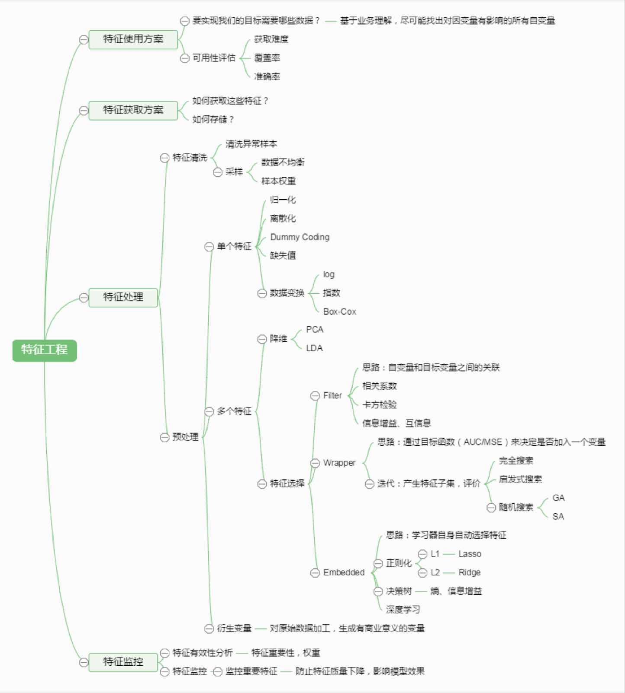

## 特征工程

特征工程是机器学习建模前的非常重要的一个步骤，它涉及很多，并且开放型也很强，怎么理解呢，就是说在特征抽象，或者特征提取的过程中，会有很多中方式方法，并且可以在建模过程中不断去探索优良的特征，最终形成最佳的特征集。本仓库中提到的一些特征工程方法也是在平常很常见的几种方法并在此归纳总结。实际的特征工程方法还需要在项目或者比赛中不断摸索。总结的不是很全面，后面还会陆续补充。



## 比赛中常见的特征工程

### 1. Numerical Features(数字类型特征)

- Can be more readily fed into algorithms
- Can contitute floats,counts,numbers
- Easier to impute missing data

#### 1.1 Rounding（小数点）
- Round nummerical variables
- Form of lossy compression:retain most signigicant features of the data
- Sometimes too much precision is just noise
- Roundes variables can be treated as categorical variables
- Can apple log transform before rounding

**Example:**
```
age                age1     age2               
-------            ----     ----
23.6671            23         2     
23.8891    ==>     23         2
22.1261            22         2
19.5506            19         1
18.2114            18         1
```
#### 1.2 Binning(分箱)
- Put numerical variables into a bin and encode with bin-ID
- Binning can be set pragmatically, by quantiles,evenly,or use models to find optimal bins
- Can work gracefully with variables outside of ranges seen in the train set

**Example:**
```
risk_score    rs[-inf,33]    rs[33,66]    rs[66,inf]  
----------    -----------    ---------    ----------
    15              1               0           0
    77              0               0           1
    78              0               0           1   
    55              0               1           0   
    42              0               1           0
```
#### 1.3 Scaling(区间缩放)

- Scale to numerical variables into a certain range
- Standard (Z) Scaling
- MinMax Scaling
- Root scaling
- Log scaling

#### 1.4 Imputation（缺失值）

- Impute missing variable
- hardcoding can be combined with imputation
- Mean:Very basic
- Median:More robust to outliers
- Ignoring:just postpones the problem
- Using a model:Cam expose algorithmic bias

```                   
wage  hours  gender   | y      wage   hours   gender-y     
----  -----  ------   | -      ----   -----   --------
1600   40       0     | 1      1600    40      0
2200   50       1     | 1 =>   2200    50      1
1800   36       0     | 0      1800    36      0
2100   45       1     | 0      2100    45      ?
2050   60       NaN   | 0      2050    60      ?
1650   36       0     | 1      1650    36      ?
```
#### 1.5 Interactions

- Specifically encodes the interactions between numerical varibles
- Try:Substraction,Addition,Multiplication,Division
- Use:Feature selection by statistical tests,or trained model feature importances
- Ignore:Human intuition;weird interactions can give significant improvement

#### 1.6. Non-linear encoding for linear algo's

- Hardcode non-linearities to improve linear algorithms
- Polynomial kernel
- Leafcoding(random forest embeddings)
- Genetic algorithms
- Loacally Linear Embedding.Spectral Embedding,t-SNE

#### 1.7 Row statistic's
- Create statistics on a row of data
- Number of NaN's
- Number of 0's
- Number of negative values
- Mean,Max,Min,Skewness,etc.

### 3. Temporal Variable
- Temporal variables.like dates, need better local validation schemes(like backtesting)
- Easy to make mistakes here
- Lots of opportunity for major improvements

#### 3.1 Projecting to a circle
- Turn single features,like day_of_weeks,into two coordinates on a circle
- Ensures that distance between max and min is the same min and min +1
- Use for day_of_week,day_of_month,hour_of_day,etc

#### 3.2 Trendlines
- Instead of encoding:total spend,encode things like:Spend in last week,spend in last month,spend in last year
- Gives a trend to the algorithem:two customers with equal spend, can have wildly different behavior——one customer may be starting to spend more,while the other is starting to  decline spending 

#### 3.3 Closeness to major events

- Hardcode categorical features like: date_3_days_before_holidays:1
- Try:National holidays,major sport events,weekends,first Saturdays of month,etc.
- These factors can have major influence on spending behavior

### Lable Engineering

- Can treat a label/target/dependent variable as a feature of the data and vice versa
- Log-transform:y->log(y+1) | exp(y_pred) - 1
- Square-transform
- Box-Cox transform
- Create a score, toturn binary target in regression
- Train regressor to predict a feature not available in test set
_______________
上述特征工程方案是一些基础的特征工程方案，另外还有一些略微中等的特征工程方案

## 项目特征工程
**特征处理之组合特征**
- 简单组合特征：拼接型
- 模型特征组合：1.用GBDT产出特征组合路径 2.组合特征和原始特征一起放进LR训练
 
**特征选择**
##### 原因：
- 冗余：部分特征的相关度太高，消耗计算性能
- 噪声：部分特征是对预测结果有负影响
##### 特征选择 vs 降维

- 前者只踢掉原本特征里和结果预测关系不大的，后者做特征的计算组合构成新特征
- SVD或者PCA也能解决一定的高维度问题

##### 常见特征选择方式之过滤型
- 评估单个特征和结果值之间的相关程度，排序留下Top相关的特征部分
- Pearson相关系数，互信息，距离相关度
- 过滤型特征选择Python包（sklearn）

##### 常见特征选择方式之包裹性

- 把特征选择看作一个特征子集搜索问题，筛选各种特征子集，用模型评估效果
- 典型的包裹型算法为“递归特征删除算法”
- 包裹性特征选择Python包(Sklearn.feature_selection.RFE)

##### 常见特征选择方式之嵌入型
- 用正则化方式来做特征选择
- 例如，在电商用LR做CTR预估，在3-5亿维的系数特征上用L1正则化的LR模型。剩余2-3千万的feature，意味着其他的feature重要度不够
 


